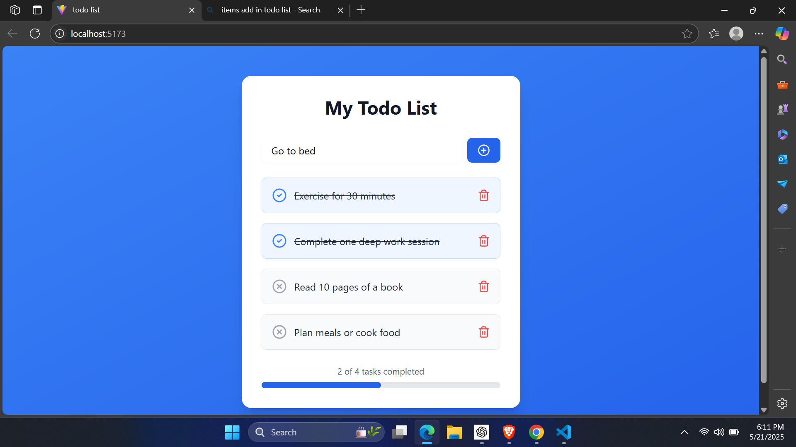

# 📝 React To-Do List App

A simple and responsive To-Do List application built with **React JS**, featuring task creation, deletion, and a progress bar to visualize completion.



---


````

---

## 🚀 Features

- Add new tasks
- Delete existing tasks
- Visual progress bar based on completed tasks
- Clean and modular component structure
- Minimal and responsive design

---

## 🛠️ Tech Stack

- React JS (with `useState` and `useEffect`)
- JavaScript (ES6+)
- CSS (basic styling)
- Vite (for development environment)

---

## 📸 Screenshot

> Located in: `img/img.jpg`  
> Used in: `README.md`

---

## 📦 Installation & Setup

1. **Clone the repo**
   ```bash
   git clone https://github.com/your-username/todo-list-react.git
   cd todo-list-react
````

2. **Install dependencies**

   ```bash
   npm install
   ```

3. **Run the app**

   ```bash
   npm run dev
   ```

4. Open [http://localhost:5173](http://localhost:5173) in your browser.

---

## 🧑‍💻 Author

* **SUjal Mendhe** – [@yourGitHub](https://github.com/sujalmendhe02)

---

## 📄 License

This project is licensed under the MIT License — feel free to use and modify.

---


